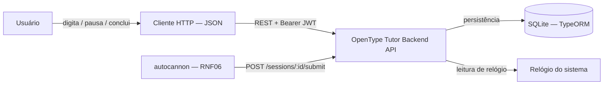
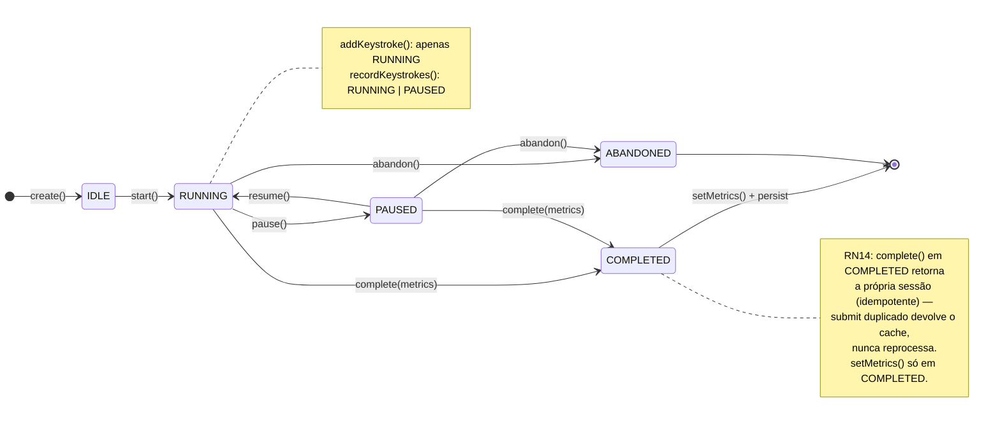
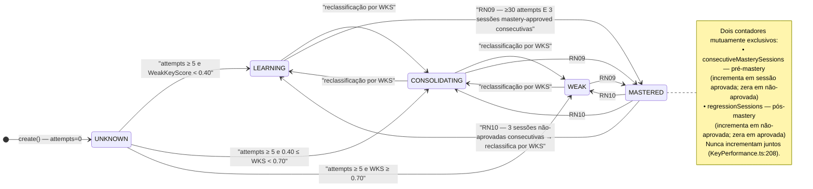
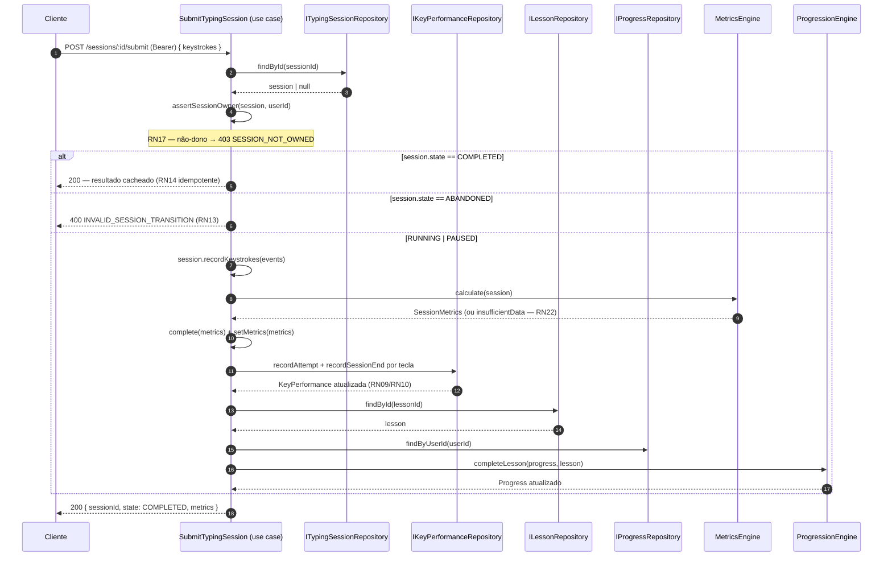
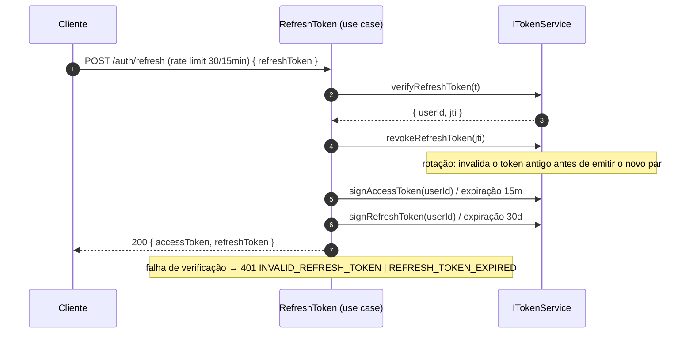

# Software Requirements Document (SRD) — OpenType Tutor Backend REST API

**Versão:** 1.0
**Data:** 2026-09-12
**Status:** Ativo — documento container; fonte única de regras de negócio e não funcionais é o `PRD.md` v1.4.

> **Natureza deste documento (Sommerville §6.2–6.4):** o SRD é o *container* formal de requisitos do sistema. Ele **não duplica** RNs, RNFs, parâmetros ou catálogo de erros — estes vivem no PRD e aqui são referenciados. Este documento agrega o que não existe no PRD: **modelos de sistema (Cap. 8)**, **especificação de interface explícita (§6.4)** e **assunções/dependências/requisitos inferidos**. Qualquer divergência entre a leitura deste documento e o PRD prevalece o PRD (decisão registrada no ADR-015).

---

## 1. Introdução

### 1.1 Propósito

Definir, em nível de sistema, o que deve ser construído pela API REST do OpenType Tutor: requisitos de usuário e de sistema (rastreados ao PRD), arquitetura de referência, modelos de sistema (comportamental, estrutural, interação e contexto), o contrato de interface HTTP e as assunções/restrições de projeto sob as quais o domínio opera.

Público-alvo: engenheiros, agentes de IA e revisores que precisam de um mapa único do sistema — **do requisito ao modelo, do modelo ao teste**.

### 1.2 Escopo

* Backend REST API (Node.js/TypeScript, Clean Architecture — ADR-003).
* Persistência local SQLite (ADR-014), sem integrações externas remotas nesta versão.
* Autenticação JWT (access `15m` + refresh `30d` com rotação — ADR-010, ADR-013), sem OAuth (fora de escopo).
* Fora de escopo desta versão: frontend (`desktop/` legado e a UI web da Fase 8 — ver abaixo), OAuth, recuperação de senha, migração SQLite→PostgreSQL (gatilhos no ADR-013/ADR-014).
* **Apresentação de cliente:** os clientes de interface (desktop customtkinter e a futura UI Next.js, Fase 8) seguem o **protocolo MVC** (ADR-018): `models/` (DTOs), `views/` (telas/componentes), `controllers/` (orquestração), `services/` (transporte REST). O SRD modela o backend e o contrato HTTP; a estrutura interna de apresentação é regida pelo ADR-018 e não é duplicada aqui.

### 1.3 Leitores e navegação

| Leitor | Por onde começar |
|---|---|
| Não técnico | PRD §2.3 (Requisitos de Usuário) e §1 (Visão Geral) |
| Engenheiro de backend | PRD §27 (RN), PRD §28 (RNF), SRD §5 (modelos) e §6 (interface) |
| Revisor/auditor | SRD §9 A (rastreabilidade), PRD §29 (estratégia de testes) |

### 1.4 Glossário

* **RN** — Regra de negócio (requisito funcional/domínio/não funcional) numerada RN01–RN23, especificada no PRD §27.
* **RNF** — Requisito não funcional, especificado no PRD §28.
* **Layout** — `ABNT2` ou `US-INTERNATIONAL` (value object `Layout`, PRD §7).
* **KeyPerformance** — entidade de desempenho por `(userId, logicalKey, layout)` (PRD §16–§20).
* **Mastery** — critério de domínio para uma tecla (RN09/RN10), ver SRD §5.2.2.
* **Erro de domínio** — `DomainError` com `code` + `message` pt-BR, mapeado a HTTP no catálogo (PRD §28.5).

### 1.5 Referências e convenção linguística

* Documentos-fonte: `PRD.md` v1.4 (fonte única), `ADR.md`, `BACKLOG.md`, `CONSTITUTION.md`.
* Idioma (ADR-011): prosa em pt-BR; identificadores, rotas, `code` de erro e nomes de classe em inglês — exatamente como no código, para que diagramas e código coincidam sem tradução.

---

## 2. Requisitos de Usuário

Lista completa no **PRD §2.3** (obrigatórios "deve" e desejáveis "pode"). Aqui apenas a **matriz de rastreabilidade** usuário→sistema:

| # | Requisito de usuário (PRD §2.3) | Requisitos de sistema (PRD) |
|---|---|---|
| UR1 | Cadastro e login por e-mail/senha | §13 (RN16–RN18), §26, ADR-004/010/013 |
| UR2 | Isolamento entre usuários | §13.1 (RN17), §6/§7 |
| UR3 | Escolha de layout | §7 (`UserProfile.activeLayout`), RN11 |
| UR4 | Sessões e eventos de teclado com ciclo de vida | §9–§11 |
| UR5 | Métricas ao final da sessão | §12, §14–§15, §10 |
| UR6 | Desempenho por tecla ao longo do tempo | §16–§20 |
| UR7 | Lições de reforço adaptativas | §24–§25 |
| UR8 | Progressão curricular | §22–§23 |
| UR9 | Autenticação/autorização obrigatória | §13 (RN16/RN17) |
| UR10 | Sessões insuficientes sem métricas | RN22, §26 |
| UR11 | Respostas JSON e erros padronizados pt-BR | RNF01/RNF02, §28.5, ADR-011 |

---

## 3. Arquitetura do Sistema

*Resumo; detalhes em PRD §3–§4 e ADR-003/ADR-005.*

* Clean Architecture em camadas `presentation → application → domain ← infrastructure` (regra de dependência estrita, enforcement por `eslint-plugin-boundaries`).
* Clientes de apresentação (desktop e web) seguem o **protocolo MVC** (ADR-018) — Views→Controllers→Services→REST; nenhuma RN é reimplementada no cliente (RN14/RN16/RN17/RN22 permanecem no backend).
* Domínio puro, sem dependências externas (RNF07); dependências por **portas** (`I*Repository`, `ITokenService` — ADR-005).
* Autenticação: JWT Bearer com refresh token rotativo (ADR-010, ADR-013).
* Persistência: SQLite via TypeORM (ADR-014).
* Log estruturado Pino; erros em formato único (`AppError` → catálogo §28.5).

---

## 4. Requisitos de Sistema

Regras de negócio e não funcionais **residem integralmente no PRD** — este documento é o índice de navegação, não uma cópia.

### 4.1 Mapa RN → seção do PRD

| Faixa | Seção PRD | Escopo |
|---|---|---|
| RN01–RN03 | §12, §14, §15 | Métricas de sessão (WPM, accuracy, latência) |
| RN04–RN07 | §16 | Fatores de `WeakKeyScore` |
| RN08–RN10 | §17–§19 | Estados de domínio, mastery e regressão |
| RN11 | §7, §16 | Isolamento por layout |
| RN12 | §14.2 | Correção não gera novo erro |
| RN13 | §9–§10 | Sessão abandonada não afeta desempenho |
| RN14 | §9 | Idempotência de submit |
| RN15–RN18 | §13 | Autenticação/autorização/segurança |
| RN19 | §24–§25 | Desempate de arredondamento de pools |
| RN20 | §16 | Definição de `KeyAccuracy` |
| RN21 | §12 | `FinalUncorrectedErrors` |
| RN22 | §10, §26 | `insufficient-data` |
| RN23 | §24.4 | Fallback de lição de reforço |
| RN33 | §27, §26, §28.5 | Pacing de prática (bloco 15 min → pausa 3 min) |
| RN34 | §27, §26 | Dashboard — mapa de calor de teclas (janela 7 dias) |
| RN35 | §27, §26 | Dashboard — tendência por janelas 7/30/90 (agregado diário pré-computado) |
| RN36 | §27, §26 | Dashboard — `MasteryProximityIndex` (pesos `MPI_*`) |
| RN37 | §27, §26 | Dashboard — fuso horário do usuário (`UserProfile.timezone`) |

### 4.2 Mapa RNF → seção do PRD

PRD §28.1 (produto), §28.2 (organizacionais), §28.3 (externos), §28.4 (conflitos), §28.5 (catálogo de erros). Destaques funcionais para o runtime: RNF01 (JSON), RNF02 (formato de erro), RNF05 (configuração centralizada — §26), RNF06 (performance `p95 ≤ 150ms`), RNF08 (segurança de logs), RNF09 (idioma pt-BR), **RNF11 (dashboard `p95 ≤ 500ms` com 1 ano de dados — ADR-020)**.

---

## 5. Modelos de Sistema

Modelos produzidos segundo Sommerville Cap. 8, **espelhando o código implementado em `src/domain/` e `src/application/`** (identificadores em inglês, anotações em pt-BR — ADR-011). Legenda comum: estado, interação, estrutura e contexto.

### 5.1 Contexto do sistema



### 5.2 Modelos comportamentais (máquinas de estado)

#### 5.2.1 Ciclo de vida da `TypingSession` (PRD §9, RN12–RN14)

Estados reais no código: `IDLE | RUNNING | PAUSED | COMPLETED | ABANDONED`.



Transições inválidas → `INVALID_SESSION_TRANSITION` (400) via `VALID_TRANSITIONS` (`TypingSession.ts:25`).

#### 5.2.2 Ciclo de domínio da `KeyPerformance` (PRD §17–§19, RN08–RN10)

Estados reais no código: `UNKNOWN | LEARNING | CONSOLIDATING | WEAK | MASTERED`. Classificação contínua por `WeakKeyScore`:

* `≥ 0.70` → `WEAK` (prioridade de reforço, RN19)
* `0.40 – 0.70` → `CONSOLIDATING`
* `< 0.40` → `LEARNING`
* `attempts < 5` → `UNKNOWN` (RN08)



Gate de "mastery-approved" por sessão (SubmitTypingSession.ts:92): `keyAccuracy ≥ 0.95` **E** `averageLatencyMs ≤ 500ms` (parametrizado em §26).

### 5.3 Modelo estrutural (diagrama de classes do domínio)

Espelho de `src/domain/entities`, `value-objects`, `services` e `repositories` (portas).

```mermaid
classDiagram
  direction LR

  class SessionId
  class Email
  class Layout

  class User {
    +id: SessionId
    +name: string
    +email: Email
    +passwordHash: string
    +create(props): User
    +toDTO(): UserDTO
  }
  class UserProfile {
    +userId: SessionId
    +activeLayout: Layout
    +currentLevel: number
    +changeLayout(Layout): UserProfile
    +advanceLevel(): UserProfile
  }
  class Lesson {
    +id: SessionId
    +level: number
    +title: string
    +content: string
    +targetKeys: string[]
    +difficulty: GUIDED | REINFORCEMENT | FREE
    +type: INTRODUCTION | PRACTICE | REINFORCEMENT | ASSESSMENT
    +layout: Layout
  }
  class TypingSession {
    +id: SessionId
    +userId: SessionId
    +lessonId: SessionId
    +layout: Layout
    +state: SessionState
    +startedAt: number
    +completedAt: number | null
    +activeDurationMs: number
    +metrics: SessionMetrics | null
    +start(): TypingSession
    +pause(): TypingSession
    +resume(): TypingSession
    +complete(metrics): TypingSession
    +abandon(): TypingSession
    +recordKeystrokes(evts): TypingSession
  }
  class KeystrokeEvent {
    +expectedKey: string
    +typedKey: string
    +physicalKey: string
    +logicalKey: string
    +eventType: CORRECT | INCORRECT | CORRECTION | DEAD_KEY_COMPOSE
    +timestampMs: number
    +latencyMs: number
  }
  class SessionMetrics {
    +charactersTyped: number
    +correctCharacters: number
    +incorrectCharacters: number
    +correctedErrors: number
    +finalUncorrectedErrors: number
    +accuracy: number
    +grossWpm: number
    +netWpm: number
    +activeDurationMs: number
    +averageLatencyMs: number
    +insufficientData(): SessionMetrics
  }
  class KeyPerformance {
    +userId: SessionId
    +logicalKey: string
    +layout: Layout
    +attempts: number
    +errors: number
    +averageLatencyMs: number
    +consecutiveMasterySessions: number
    +regressionSessions: number
    +masteryState: MasteryState
    +recordAttempt({isError, latencyMs})
    +recordSessionEnd(isMasteryApproved)
  }
  class Progress {
    +id: SessionId
    +userId: SessionId
    +currentLessonId: SessionId
    +currentLevel: number
    +completedLessons: number
    +completeLesson(nextLessonId)
    +advanceLevel()
  }
  class PracticePacingState {
    +userId: SessionId
    +accumulatedActiveMs: number
    +lastSessionEndedAt: Date | null
    +recordCompletedSession(activeDurationMs, now): PracticePacingState
    +isBreakRequired(now): boolean
    +breakRemainingMs(now): number
    +isNewBlockEligible(now): boolean
  }

  class DailyMetricsAggregate {
    +userId: SessionId
    +layout: Layout
    +date: string // YYYY-MM-DD local (RN37)
    +sessionsCompleted: number
    +totalActiveMs: number
    +totalGrossChars: number
    +totalCorrectChars: number
    +totalErrors: number
    +totalLatencyMs: number
    +totalLatencySamples: number
    +keysPracticed: Set<string>
    +merge(session: SessionMetrics, keys, now): DailyMetricsAggregate
    +netWpm(): number
    +accuracy(): number
    +averageLatencyMs(): number
  }

  class KeyMasteryTransition {
    +userId: SessionId
    +logicalKey: string
    +layout: Layout
    +date: string
    +from: MasteryState
    +to: MasteryState
  }

  class MetricsEngine {
    +calculate(session): SessionMetrics
  }
  class ProgressionEngine {
    +completeLesson(progress, lesson): Progress
  }
  class AdaptiveLessonEngine {
    +buildReinforcement(...): Lesson
  }
  class MasteryProximityIndex {
    +compute(keyPerformance): number // MPI ∈ [0,1] (RN36)
    +band(score): string
  }

  note for MetricsEngine "RN21: FinalUncorrectedErrors = max(0, erros − corrigidos) | RN22: sessão curta/insuficiente → insufficientData()"
  note for AdaptiveLessonEngine "RN19: desempate WEAK > CONSOLIDATING > MASTERED | RN23: fallback N-gram quando pool vazio"

  User --> SessionId
  User --> Email
  UserProfile --> SessionId
  UserProfile --> Layout
  Lesson --> SessionId
  Lesson --> Layout
  TypingSession --> SessionId
  TypingSession --> Layout
  TypingSession "1" *-- "0..*" KeystrokeEvent
  TypingSession "1" o-- "0..1" SessionMetrics
  KeyPerformance --> SessionId
  KeyPerformance --> Layout
  Progress --> SessionId

  MetricsEngine ..> TypingSession : lê
  MetricsEngine ..> SessionMetrics : produz
  ProgressionEngine ..> Progress : atualiza
  AdaptiveLessonEngine ..> KeyPerformance : consome
  AdaptiveLessonEngine ..> Lesson : produz

  class IUserRepository
  class IUserProfileRepository
  class ILessonRepository
  class ITypingSessionRepository
  class IKeyPerformanceRepository
  class IProgressRepository
  class INGramRepository
  class IPracticePacingRepository
  class IDailyMetricsAggregateRepository
  class IKeyMasteryTransitionRepository
  IUserRepository ..> User
  IUserProfileRepository ..> UserProfile
  ILessonRepository ..> Lesson
  ITypingSessionRepository ..> TypingSession
  IKeyPerformanceRepository ..> KeyPerformance
  IProgressRepository ..> Progress
  IPracticePacingRepository ..> PracticePacingState
  IDailyMetricsAggregateRepository ..> DailyMetricsAggregate
  IKeyMasteryTransitionRepository ..> KeyMasteryTransition

  note for PracticePacingState "RN33: bloco ≥ PRACTICE_BLOCK_DURATION_MS (15 min) e pausa < MIN_BREAK_DURATION_MS (3 min) → break obrigatório; relógio sempre injetado | ABANDONED não acumula (RN13)"
  note for IPracticePacingRepository "isolada por userId (RN17)"
  note for DailyMetricsAggregate "RN35/RNF11: contadores somáveis por (userId, layout, date); merge no submit (RN14 idempotente); netWpm/precisão/latência derivadas na leitura | RN37: date em timezone do usuário"
  note for IDailyMetricsAggregateRepository "isolada por userId (RN17)"
  note for KeyMasteryTransition "log de mudanças de masteryState no recordSessionEnd; alimenta a timeline sem varrer sessões"
  note for MasteryProximityIndex "RN36: MPI satura em 1.0 só com os 4 gates do RN09; pesos MPI_W_* em adaptiveParams"
```

> Limites Clean Architecture: o bloco acima é **domínio puro** (entidades + VOs + serviços + portas de repositório). Use cases (`src/application/use-cases/*`) e DTOs não aparecem por legibilidade — veja §5.4 e §9 A para rastreabilidade com a camada de aplicação.

### 5.4 Modelos de interação (diagramas de sequência)

#### 5.4.1 Submit de sessão (RN14 idempotência, RN13 abandon, RN17 posse, RN22 dados insuficientes)



> Nota RN22: em `MetricsEngine.ts:12`, sessões com `activeDurationMs < 3000` ou `charactersTyped < 5` (thresholds parametrizados no PRD §26) retornam o sentinela `SessionMetrics.insufficientData()` — o domínio **não lança erro**, expõe `isInsufficientData()`. No nível HTTP, o contrato mapeia `InsufficientSessionDataError` → `422 INSUFFICIENT_SESSION_DATA` (catálogo §28.5), verificado em `app.test.ts:631`.

#### 5.4.2 Rotação de refresh token (ADR-010, ADR-013)



---

## 6. Especificação de Interface

*Interface HTTP de sistema (Sommerville §6.4 — interface de procedimentos/API). Contrato de erro e mensagens: PRD §28.5 (catálogo — fonte única). Este é o **índice** de rotas; o contrato detalhado (schemas Zod) vive em `src/presentation/routes/*` e `src/presentation/validators/*`.*

### 6.1 Contrato geral

* Formato: `application/json`.
* Autenticação: header `Authorization: Bearer <accessToken>`; `authMiddleware` extrai `userId` (nunca do corpo/rota — RN17, PRD §13.1).
* Erro padrão: `{ "error": { "code", "message" } }` — RNF02, pt-BR (ADR-011).
* Rate limiting: `POST /auth/login` 10 tentativas/15min; `POST /auth/refresh` 30/15min — `TOO_MANY_REQUESTS` (429), parâmetros em `infrastructure/auth/rateLimitParams.ts` (ADR-013).

### 6.2 Tabela de rotas

| Método | Rota | Auth | Use case | Sucesso | Erros principais (catálogo §28.5) |
|---|---|---|---|---|---|
| POST | `/auth/register` | — | `RegisterUser` | 201 | `VALIDATION_ERROR` (422), `USER_ALREADY_EXISTS` (409) |
| POST | `/auth/login` | RL | `Login` | 200 `{token, refreshToken}` | `INVALID_CREDENTIALS` (401), `TOO_MANY_REQUESTS` (429) |
| POST | `/auth/refresh` | RL | `RefreshToken` | 200 `{accessToken, refreshToken}` | `INVALID_REFRESH_TOKEN`/`REFRESH_TOKEN_EXPIRED` (401), `TOO_MANY_REQUESTS` (429) |
| GET | `/users/me` | ✓ | `GetUser` | 200 | `UNAUTHORIZED` (401) |
| PATCH | `/users/me` | ✓ | `UpdateUserLayout` | 200 | `PROFILE_NOT_OWNED` (403), `VALIDATION_ERROR` (422) |
| GET | `/lessons` | ✓ | `ListLessons` | 200 | `UNAUTHORIZED` (401) |
| GET | `/lessons/:id` | ✓ | `GetLesson` | 200 | `LESSON_NOT_FOUND` (404) |
| POST | `/sessions` | ✓ | `StartTypingSession` | 201 | `VALIDATION_ERROR` (422) |
| POST | `/sessions/:id/pause` | ✓ | `PauseTypingSession` | 200 | `SESSION_NOT_FOUND` (404), `SESSION_NOT_OWNED` (403), `INVALID_SESSION_TRANSITION` (400) |
| POST | `/sessions/:id/resume` | ✓ | `ResumeTypingSession` | 200 | idem pause |
| POST | `/sessions/:id/abandon` | ✓ | `AbandonTypingSession` | 200 | idem pause |
| POST | `/sessions/:id/submit` | ✓ | `SubmitTypingSession` | 200 (cache RN14) | `SESSION_NOT_FOUND` (404), `SESSION_NOT_OWNED` (403), `INVALID_SESSION_TRANSITION` (400, ABANDONED), `INSUFFICIENT_SESSION_DATA` (422, RN22) |
| GET | `/me/progress` | ✓ | `GetUserProgress` | 200 | `UNAUTHORIZED` (401) |
| GET | `/me/key-performance` | ✓ | `GetUserKeyPerformance` | 200 | `UNAUTHORIZED` (401) |
| GET | `/me/reinforcement-lesson` | ✓ | `GetReinforcementLesson` | 200 | `UNAUTHORIZED` (401) |
| GET | `/me/pedagogical-lesson` | ✓ | `GetNextPedagogicalLesson` | 200 | `UNAUTHORIZED` (401), `VALIDATION_ERROR` (422, query `confirmsNoLookingAtKeyboard`) |
| GET | `/me/practice-status` | ✓ | `GetPracticeStatus` | 200 `{accumulatedActiveMs, practiceBlockMs, minBreakMs, breakRequired, breakRemainingMs}` | `UNAUTHORIZED` (401) |
| GET | `/me/dashboard/habits` | ✓ | `GetDashboardHabits` | 200 `{kpis, trend[], heatmap[]}` | `UNAUTHORIZED` (401) |
| GET | `/me/dashboard/mastery` | ✓ | `GetDashboardMastery` | 200 `{transitions[], countsByState}` | `UNAUTHORIZED` (401) |
| GET | `/me/dashboard/proximity` | ✓ | `GetDashboardProximity` | 200 `{keys[]}` (MPI + banda por tecla) | `UNAUTHORIZED` (401) |
| POST | `/me/progress-card` | ✓ | `SubmitProgressCard` | 201 | `UNAUTHORIZED` (401), `VALIDATION_ERROR` (422) |
| POST | `/me/ergonomic-check` | ✓ | `CheckErgonomicSafety` | 201 | `UNAUTHORIZED` (401), `VALIDATION_ERROR` (422), `DISCOMFORT_SIGNALED` (422, RN28) |
| GET | `/health` | — | — | 200 | — |

> Nota: o código `SESSION_ALREADY_COMPLETED` (409) existe no catálogo §28.5; no caminho implementado de `submit`, sessão `COMPLETED` **não** é erro — retorna `200` com o resultado cacheado (RN14). O código permanece catalogado para compatibilidade/consumidores que o emitiam.

---

## 7. Assunções, Dependências e Requisitos Inferidos

### 7.1 Assunções

* **A1 — Cliente de teclado:** existe um cliente que coleta `KeystrokeEvent`s completos (incluindo `DEAD_KEY_COMPOSE`) e só envia o lote no submit; a gravação fora do submit (tempo contínuo) não é prevista nesta versão.
* **A2 — Relógio do sistema:** timestamps de sessão e de evento usam o mesmo relógio do servidor; não há sincronização distribuída (SQLite local).
* **A3 — Volume:** single-process, single-writer (SQLite, ADR-014); concorrência é mitigada por transação/otimismo no submit (TASK-054), não por escalonamento.
* **A4 — N-grams:** o corpus de N-grams pt-BR existe e é pré-carregado (porta `INGramRepository`); sem ele, RN23 usa fallback de ordem de prática.
* **A5 — Pacing (RN33):** relógio do servidor é a fonte de verdade para bloco/pausa (`now` injetado no domínio — testes determinísticos); "bloco" acumula a prática ativa completada do dia; após a pausa de 3 min o acumulador zera, reiniciando a sequência 15:3.
* **A6 — Timezone (RN37):** `UserProfile.timezone` (IANA, default `America/Sao_Paulo`) define o dia calendário local usado na agregação diária; a conversão UTC→local é feita na **escrita** do agregado e nos **rótulos** de leitura — nunca no agrupamento de leitura (ADR-020).
* **A7 — Pré-agregação (RNF11):** o `DailyMetricsAggregate` é mantido pelo `submit` (upsert idempotente) e o dashboard **só lê agregados** (SUM/COUNT por janela) — nenhuma varredura de sessões por request; `KeyMasteryTransition` loga apenas mudanças de estado. Reset de progresso (RN31) limpa também essas tabelas.

### 7.2 Dependências entre requisitos

* **RN09 depende de RN20/RN21** — o gate de sessão "aprovada" usa `KeyAccuracy` (RN20) e latência média (RN21). Alterar RN21 ou os coeficientes de `SessionMetrics` altera o critério de mastery.
* **RN10 e RN09 são mutuamente exclusivos por contador** (`consecutiveMasterySessions` vs `regressionSessions`, §19) — implementação em `KeyPerformance.ts:208`.
* **RN22 depende de `MIN_SESSION_DURATION_MS`/`MIN_SESSION_CHARACTERS`** (PRD §26) — os literais não devem ser tocados fora de `adaptiveParams.ts` (RNF05).
* **RN11 (isolamento por layout)** — `KeyPerformance` é chaveada por `(userId, logicalKey, layout)`; mudar o `Layout` de um usuário continua isolando os históricos (spec treina séries distintas).
* **RN12 ↔ dead keys:** correção de resultado de composição conta como um erro corrigido, um único `CORRECTION` por caractere composto (PRD §11.3, AGENTS.md gotcha 6).
* **RNF06 (perf) ↔ infra:** SQLite em arquivo e payload ≤1500 eventos são o orçamento do p95 ≤150ms — qualquer mudança no store ou no formato do `KeystrokeEvent` deve revalidar o benchmark (`npm run bench`, TASK-065).
* **RN36 depende de RN09/RN20** — o `MasteryProximityIndex` reutiliza os mesmos gates (`MASTERY_ACCURACY`, `MASTERY_ATTEMPTS`, `MASTERY_LATENCY_MS`, `MASTERY_CONSECUTIVE_SESSIONS`); alterar RN09 muda o envelope que o índice mede.
* **RNF11 ↔ infra:** o orçamento de `p95 ≤ 500ms` do dashboard depende da pré-agregação (ADR-020) e de manter `submit +1 WRITE`; mudar a estratégia de agregação ou ampliar payload/volume deve revalidar `npm run bench:dashboard`.

### 7.3 Requisitos inferidos da implementação

| Inferência | Origem |
|---|---|
| `recordKeystrokes` é permitido em `RUNNING` e `PAUSED`; `addKeystroke` apenas em `RUNNING` | `TypingSession.ts:261,281` |
| Sessão `COMPLETED` nunca mais transiciona (`VALID_TRANSITIONS.COMPLETED = []`) | `TypingSession.ts:29` |
| `KeyPerformance` reclassifica sem sessão (attempt) e por sessão (`recordSessionEnd`) de formas distintas | `KeyPerformance.ts:161,208` |
| `SessionMetrics.insufficientData()` é o sentinela de RN22 (all-zero + flag via `isInsufficientData()`) | `SessionMetrics.ts:83,98` |
| `userId` de todas as operações vem exclusivamente do token (nunca do corpo) — reforçado no `authMiddleware` | PRD §13.1, ADR-010 |

---

## 8. Evolução do Sistema

* **Histórico e versões:** changelog no topo do PRD (v1.0→v1.6). SRD v1.0 corresponde ao PRD v1.4; SRD v1.1 ao PRD v1.6 (RN34–RN37, RNF11, ADR-020 — Fase 9).
* **Fora de escopo / gatilhos:** PRD §13.3–13.4, ADR-013 (OAuth, recuperação de senha, rate limiting) e ADR-014 (PostgreSQL).
* **Estado atual:** PRD §33.
* **Política:** qualquer mudança de RN/RNF **primeiro** no PRD (SDD/CONSTITUTION), depois reflexo nos modelos deste SRD quando aplicável; SRD nunca é a fonte de uma regra.

---

## 9. Apêndices

### A. Índice de rastreabilidade RN → Modelo → Teste

| RN | Modelo (§5) | Teste de referência |
|---|---|---|
| RN08/09/10 | §5.2.2 (máquina KeyPerformance) | `src/domain/entities/KeyPerformance.test.ts` |
| RN12/13/14 | §5.2.1 (máquina TypingSession); §5.4.1 | `src/domain/entities/TypingSession.test.ts`; `src/application/use-cases/SubmitTypingSession.test.ts` |
| RN16/17 | §5.4.1 (`assertSessionOwner`); §5.4.2 | `src/presentation/app.test.ts`; `src/application/use-cases/RefreshToken.test.ts` |
| RN22 | §5.4.1 (Nota RN22) | `src/presentation/app.test.ts:631` |
| RN19/23 | Figuras §5.3 (notas) | `src/domain/services/AdaptiveLessonEngine.test.ts` |
| RN20/21 | Figuras §5.3 (notas) | `src/domain/services/MetricsEngine.test.ts` |
| RN33 | Figuras §5.3 (notas `PracticePacingState`); §6.2 (`/me/practice-status`) | `src/domain/entities/PracticePacingState.test.ts`; `src/application/use-cases/StartTypingSession.test.ts`; `src/application/use-cases/SubmitTypingSession.test.ts` |
| RN34/35/37 | Figuras §5.3 (notas `DailyMetricsAggregate`); §6.2 (`/me/dashboard/habits`) | `src/domain/entities/DailyMetricsAggregate.test.ts`; `src/application/use-cases/GetDashboardHabits.test.ts` |
| RN36 | Figuras §5.3 (notas `MasteryProximityIndex`); §6.2 (`/me/dashboard/proximity`) | `src/domain/services/MasteryProximityIndex.test.ts`; `src/application/use-cases/GetDashboardProximity.test.ts` |
| RN37 | §7.1 (A6) | `src/domain/value-objects/Timezone.test.ts`; `src/domain/entities/DailyMetricsAggregate.test.ts` |

### B. Notação e convenções

* Diagramas em **Mermaid**, versionados em markdown.
* Identificadores em inglês (coincidem com o código); notas/legendas em pt-BR (ADR-011).
* Estado/máquinas extraídas das tabelas `VALID_TRANSITIONS` (`TypingSession.ts:25`) e do fluxo `recordSessionEnd` (`KeyPerformance.ts:208`) — **não** do ideal, mas do implementado.